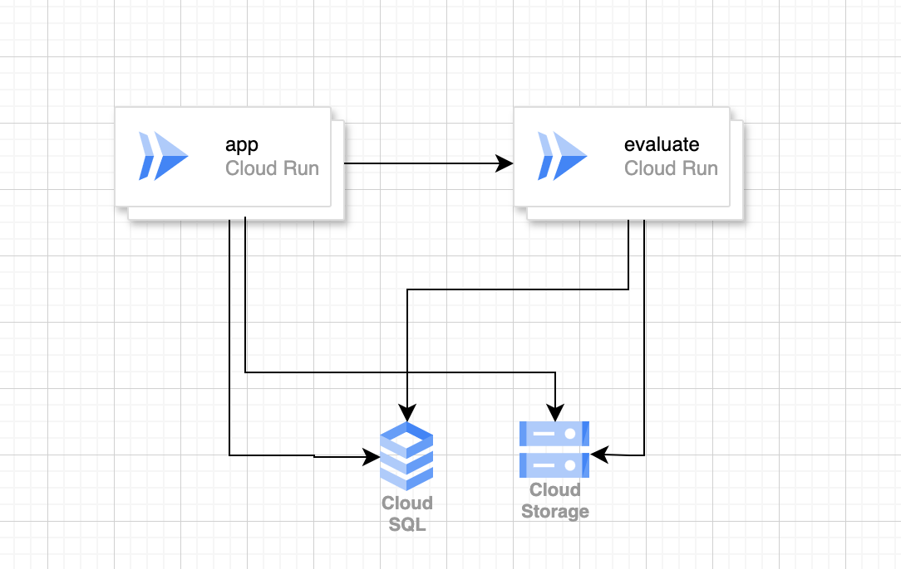
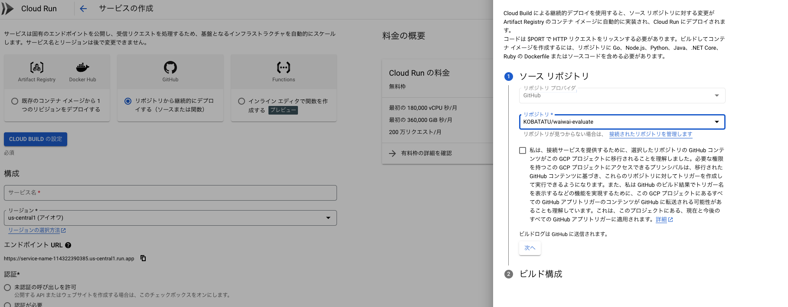
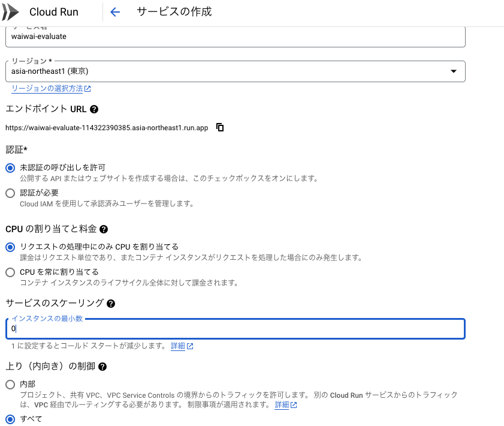
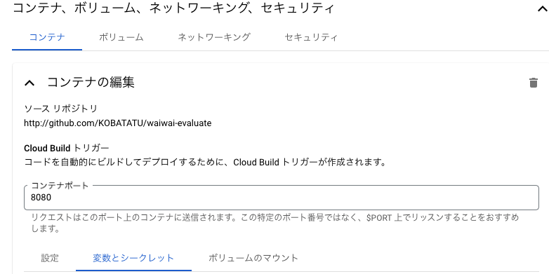
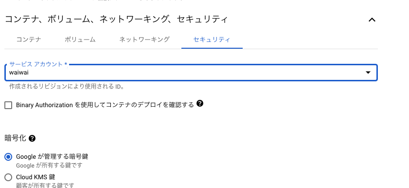

# Hosting

## Introduction

Thank you for reviewing this document. This document provides instructions for hosting OSS using GCP.

## Prerequisites

- GCP account is required.
- Hosting of `waiwai` must be completed.
- This OSS has been pushed to or forked from GitHub.

## Architecture

The overview diagram is as follows. We will use `Cloud Run` to easily set up the server. Here, we will set up the evaluation for `evaluate`.



## App

We will proceed according to the following steps.

### Starting Cloud Run

First, start Cloud Run.



From the Cloud Run interface, link to your GitHub repository. You may be redirected to GitHub for authentication.



Please refer to the following settings.



Set the environment variables as follows. Use the values that were used in the `waiwai` app. However, for `DATABASE_URL`, please append `asyncpg` after `postgresql`, like this: `DATABASE_URL=postgresql+asyncpg://user:...`.

```
GCS_BUCKET=
DATABASE_URL=
```



Set the service account to the value used in the `waiwai` app.

That's all.
